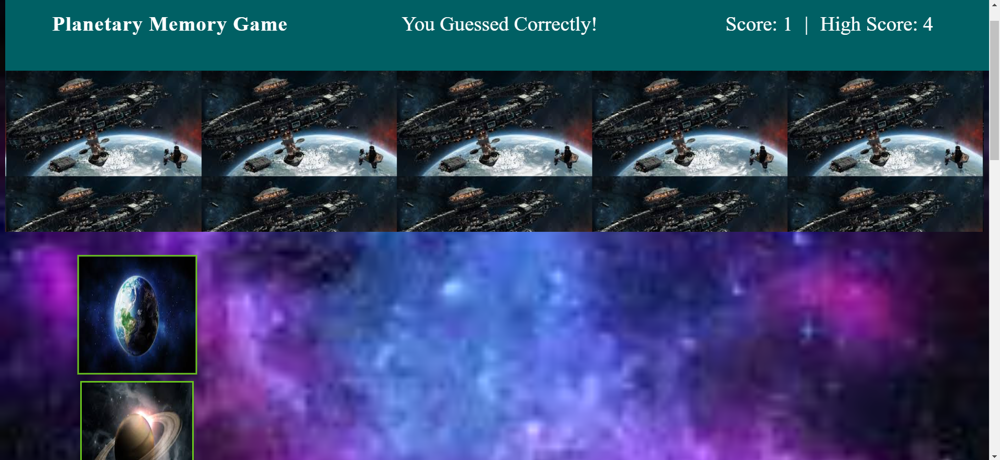
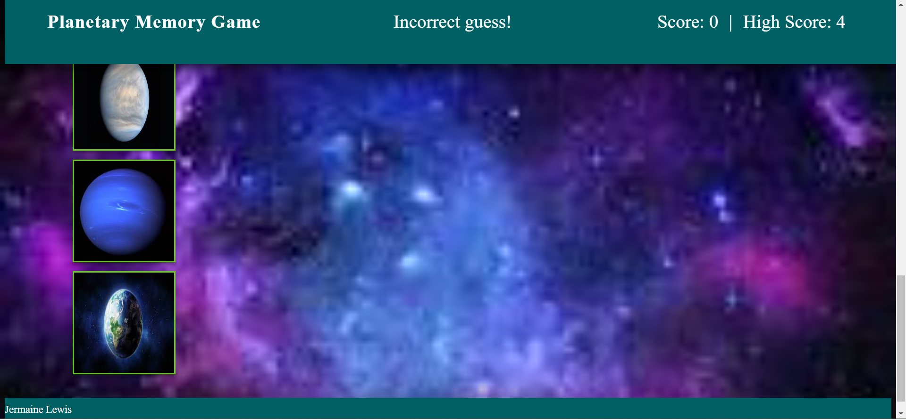

# Planetary Memory Game
This Application is game that challenges a user's memory. The user gets to choose from nine planets, then the user must remember the planet they clicked or get rest back to zero points. each to ta planet is clicked; the user gains a point if all the planets were clicked no more than once the user wins the game. Link to website found [here](https://ausar1989.github.io/planetary-memory-game/).

# Demonstration of Website Features

This is an image of the website before the game begins:

This is an image of the website after the game begins:

This is an image of the website when the guess was incorrect:

# Technologies Used
- React.js
- CSS
- Javascript
- HTML
- Node.js

Have a wondeful day!
